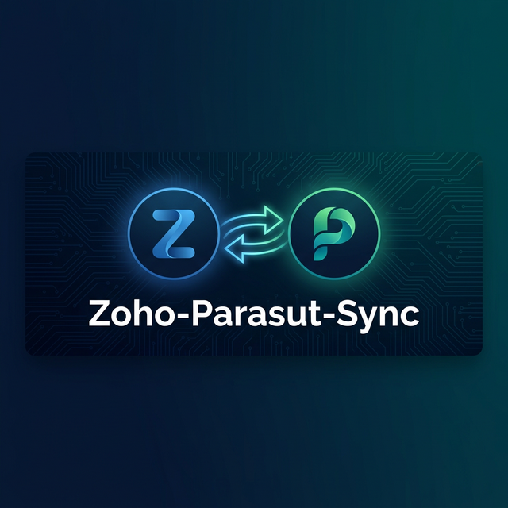

<p align="center">
  
</p>

<p align="center">
  <strong>Automated synchronization between Zoho CRM and Paraşüt</strong><br>
  <sub>Bridge your Turkish accounting software with your CRM — effortlessly.</sub>
</p>

<p align="center">
  <a href="https://github.com/mrzcn/Zoho-Parasut-Sync/blob/main/LICENSE"></a>
  <a href="https://github.com/mrzcn/Zoho-Parasut-Sync/actions"></a>
  
  
  <a href="https://github.com/mrzcn/Zoho-Parasut-Sync/stargazers"></a>
</p>

<p align="center">
  <a href="#-features">Features</a> •
  <a href="#-quick-start">Quick Start</a> •
  <a href="#-docker">Docker</a> •
  <a href="#-screenshots">Screenshots</a> •
  <a href="#-api-setup">API Setup</a> •
  <a href="#-architecture">Architecture</a> •
  <a href="#-contributing">Contributing</a>
</p>

---

## ✨ Features

| Feature | Description |
|---------|-------------|
| 📦 **Product Sync** | Automatically sync products between Paraşüt and Zoho CRM |
| 🧾 **Invoice Sync** | Two-way invoice matching and synchronization |
| 📋 **Purchase Orders** | Transfer purchase orders to Zoho CRM |
| 🔍 **Duplicate Detection** | Smart duplicate product detection and merging by product code |
| 🔄 **Related Record Updates** | When merging, all invoices/quotes/orders are automatically reassigned |
| 📊 **Dashboard** | Real-time sync status, API metrics, and queue management |
| 🔐 **Security** | CSRF protection, rate limiting, brute-force protection, Turnstile CAPTCHA |
| 🪝 **Webhooks** | Real-time triggers from both Paraşüt and Zoho |
| ⏰ **Cron Jobs** | Scheduled automatic synchronization with job queue |
| 📝 **Structured Logging** | All operations logged to database with automatic token masking |

## 🚀 Quick Start

### Option 1: Docker (Recommended)

```bash
git clone https://github.com/mrzcn/Zoho-Parasut-Sync.git
cd Zoho-Parasut-Sync
docker-compose up -d
```

Open **http://localhost:8080** and follow the setup wizard.

### Option 2: Manual Installation

```bash
git clone https://github.com/mrzcn/Zoho-Parasut-Sync.git
cd Zoho-Parasut-Sync
composer install
```

1. Create a MySQL database via your hosting panel
2. Open `https://your-domain.com/Zoho-Parasut-Sync/install.php`
3. Follow the 3-step wizard:
   - **Step 1:** Database connection (host, name, user, password)
   - **Step 2:** Table creation (15 tables auto-created)
   - **Step 3:** Admin password

### Requirements

| Requirement | Version |
|------------|---------|
| PHP | 7.4+ |
| MySQL / MariaDB | 5.7+ / 10.4+ |
| PHP Extensions | PDO, cURL, JSON |
| Composer | 2.x |

## 🐳 Docker

The project includes full Docker support for instant setup:

```bash
# Start everything
docker-compose up -d

# View logs
docker-compose logs -f app

# Stop
docker-compose down

# Reset (remove database)
docker-compose down -v
```

The Docker setup includes:
- **PHP 8.1 + Apache** with mod_rewrite enabled
- **MariaDB 10.6** with automatic schema initialization
- Volume persistence for database data
- Health checks for service readiness

## 🔧 API Setup

### Zoho CRM

1. Go to [Zoho API Console](https://api-console.zoho.com/)
2. Create a **Self Client**
3. Set scope: `ZohoCRM.modules.ALL,ZohoCRM.settings.ALL,ZohoCRM.org.ALL`
4. Paste the **Grant Token** into Settings page → Zoho section
5. Click "Generate Refresh Token"

### Paraşüt

1. Create an app at [Paraşüt API](https://api.parasut.com/)
2. Enter Client ID, Client Secret, and Company ID in Settings
3. Enter your Paraşüt username and password

## 🏗️ Architecture

```
┌──────────────────────────────────────────────────────────┐
│                    Admin Dashboard                        │
│      (Dashboard, Products, Invoices, Settings...)         │
└───────────────────────┬──────────────────────────────────┘
                        │
               ┌────────▼────────┐
               │   Controllers   │
               └────────┬────────┘
                        │
          ┌─────────────┼─────────────┐
          ▼             ▼             ▼
   ┌────────────┐ ┌──────────┐ ┌────────────┐
   │ZohoService │ │SyncService│ │ParasutSvc  │
   └──────┬─────┘ └─────┬────┘ └──────┬─────┘
          ▼             ▼             ▼
   ┌──────────┐  ┌────────────┐  ┌──────────┐
   │ Zoho CRM │  │  MySQL DB  │  │ Paraşüt  │
   │   API    │  │            │  │   API    │
   └──────────┘  └────────────┘  └──────────┘
```

### Project Structure

```
├── classes/              # Service classes (API clients, business logic)
│   ├── ZohoService.php   # Zoho CRM API client with OAuth2
│   ├── ParasutService.php# Paraşüt API client
│   ├── SyncService.php   # Comparison and sync logic
│   └── Queue.php         # Background job processing
├── controllers/          # MVC request handlers
├── config/helpers/       # Utility functions (security, logging, HTTP)
├── database/schema.sql   # Complete DB schema (15 tables)
├── cron/                 # Scheduled task runner
├── tests/                # PHPUnit test suite
├── docs/                 # Architecture documentation
└── templates/            # Shared HTML templates
```

📖 Full architecture documentation: [docs/architecture.md](docs/architecture.md)

## 🧪 Testing

```bash
# Install dev dependencies
composer install

# Run tests
composer test

# Run with coverage
composer test-coverage
```

## 🔒 Security

| Layer | Implementation |
|-------|---------------|
| Authentication | `password_hash` / `password_verify` |
| CSRF Protection | Per-session token with `hash_equals` |
| Rate Limiting | File-based sliding window |
| Brute Force | IP-based lockout after 5 attempts |
| CAPTCHA | Cloudflare Turnstile (optional) |
| API Credentials | Stored in database, never in source |
| Log Masking | Tokens auto-masked in all log output |
| Session | HttpOnly, SameSite=Lax, Secure cookies |

## 🤝 Contributing

Contributions are welcome! Please read our [Contributing Guide](CONTRIBUTING.md) before submitting a PR.

1. Fork the repository
2. Create your feature branch (`git checkout -b feature/amazing-feature`)
3. Commit your changes (`git commit -m 'feat: add amazing feature'`)
4. Push to the branch (`git push origin feature/amazing-feature`)
5. Open a Pull Request

## 📝 Changelog

See [CHANGELOG.md](CHANGELOG.md) for a detailed version history.

---

## 🇹🇷 Türkçe

**Zoho CRM ile Paraşüt muhasebe yazılımı arasında otomatik senkronizasyon.**

### Özellikler

| Özellik | Açıklama |
|---------|----------|
| 📦 **Ürün Senkronizasyonu** | Paraşüt ürünlerini Zoho CRM'e otomatik aktarım |
| 🧾 **Fatura Senkronizasyonu** | Satış faturalarını iki yönlü eşleştirme |
| 📋 **Gider Faturası Aktarımı** | Satın alma siparişlerini Zoho'ya aktarma |
| 🔍 **Mükerrer Ürün Tespiti** | Ürün koduna göre duplike algılama ve birleştirme |
| 🔄 **İlişkili Kayıt Güncelleme** | Birleştirmede fatura/teklif/sipariş referansları otomatik taşınır |
| 📊 **Dashboard** | Anlık senkronizasyon durumu, API metrikleri, kuyruk yönetimi |
| 🔐 **Güvenlik** | CSRF koruması, rate limiting, brute-force koruması, Turnstile |
| 🪝 **Webhook Desteği** | Paraşüt ve Zoho webhook'ları ile gerçek zamanlı tetikleme |
| ⏰ **Cron Desteği** | Zamanlanmış otomatik senkronizasyon ve iş kuyruğu |
| 📝 **Detaylı Log** | Tüm işlemler veritabanına loglanır, tokenlar otomatik maskelenir |

### Hızlı Kurulum

#### Yöntem 1: Docker (Önerilen)

```bash
git clone https://github.com/mrzcn/Zoho-Parasut-Sync.git
cd Zoho-Parasut-Sync
docker-compose up -d
```

Tarayıcıda **http://localhost:8080** adresini açın ve kurulum sihirbazını takip edin.

#### Yöntem 2: Manuel Kurulum

```bash
git clone https://github.com/mrzcn/Zoho-Parasut-Sync.git
cd Zoho-Parasut-Sync
composer install
```

1. Hosting panelinizden (cPanel vb.) yeni bir MySQL veritabanı ve kullanıcı oluşturun
2. Tarayıcıda `https://siteadi.com/Zoho-Parasut-Sync/install.php` adresini açın
3. Kurulum sihirbazını takip edin:
   - **Adım 1:** Veritabanı bağlantısı (host, ad, kullanıcı, şifre)
   - **Adım 2:** Tablo oluşturma (15 tablo otomatik oluşturulur)
   - **Adım 3:** Admin şifresi belirleme

### Gereksinimler

| Gereksinim | Minimum |
|-----------|---------|
| PHP | 7.4+ |
| MySQL / MariaDB | 5.7+ / 10.4+ |
| PHP Eklentileri | PDO, cURL, JSON |
| Composer | 2.x |

### 🐳 Docker

```bash
# Başlat
docker-compose up -d

# Logları izle
docker-compose logs -f app

# Durdur
docker-compose down

# Sıfırla (veritabanını da sil)
docker-compose down -v
```

### Zoho CRM API Kurulumu

1. [Zoho API Console](https://api-console.zoho.com/) adresine gidin
2. **Self Client** oluşturun
3. Scope: `ZohoCRM.modules.ALL,ZohoCRM.settings.ALL,ZohoCRM.org.ALL`
4. Oluşturulan **Grant Token**'ı Ayarlar sayfasındaki ilgili alana yapıştırın
5. "Refresh Token Oluştur" butonuna tıklayın

### Paraşüt API Kurulumu

1. [Paraşüt API](https://api.parasut.com/) adresinden uygulama oluşturun
2. Client ID, Client Secret ve Şirket ID bilgilerini Ayarlar'a girin
3. Paraşüt kullanıcı adı ve şifrenizi girin

### 🔒 Güvenlik

| Katman | Uygulama |
|--------|----------|
| Kimlik Doğrulama | `password_hash` / `password_verify` |
| CSRF Koruması | Oturum bazlı token, `hash_equals` doğrulama |
| Hız Sınırlama | Dosya tabanlı kayan pencere |
| Kaba Kuvvet | 5 denemeden sonra IP bazlı kilitleme |
| CAPTCHA | Cloudflare Turnstile (isteğe bağlı) |
| API Kimlik Bilgileri | Veritabanında saklanır, kaynak kodda asla yer almaz |
| Log Maskeleme | Tokenlar tüm log çıktısında otomatik maskelenir |
| Oturum | HttpOnly, SameSite=Lax, Secure çerezler |

### 🧪 Test

```bash
composer install
composer test
```

### 🤝 Katkıda Bulunma

Katkılarınızı bekliyoruz! PR göndermeden önce [Katkı Kılavuzu](CONTRIBUTING.md)'nu okuyun.

---

## 📄 Lisans / License

[MIT License](LICENSE) — Copyright (c) 2026 Nolto

